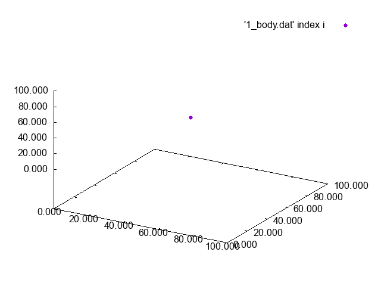
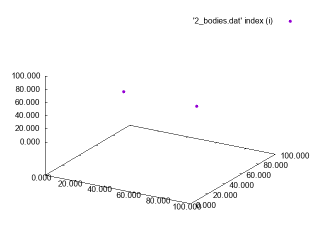
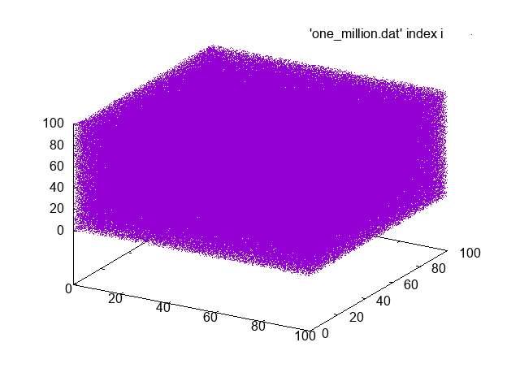
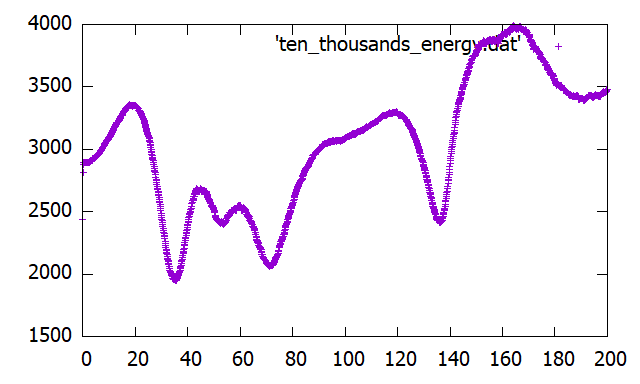
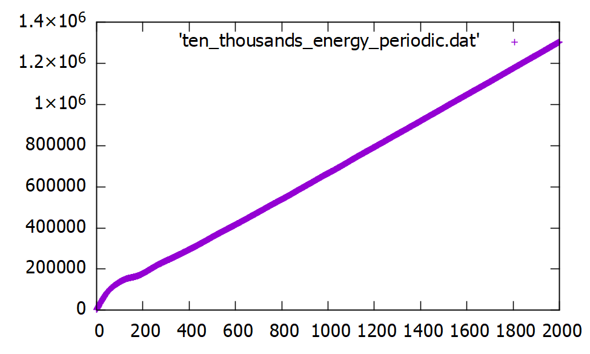

# N-Bodies Simulation

The c code in this repository simulates the evolution of bodies into space using the particle-mesh method.

It first initializes a cell space (periodic or not) with different parameters regarding bodies.
For each of the time steps, the code iterates over those steps:
- The space density of each cell is computer with linear cloud in cell.
- The potential is computer using a relaxation solver to solve the gravitational poisson's equation.
- The force on each body is computer again by taking the gradient of the cloud in cell potential.
- The velocity and the position of each body is changed with respect to the force.

After creating the data, it is then plotted using gnuplot.

# Part 1 - 1 Body
A single body in space should stay immobile:

# Part 2 - 2 Bodies
Two bodies should orbit each other:

# Part 3 - Many bodies
Unfortunately, too many bodies are hard to visualize:

So we need to limit the number of bodies.
Here are 100 000 bodies evolving slowly with times. I am not sure wheter there is a bias near the center of the space or the "lines" are perks of living in a cubic universe.

Using periodic boundary conditions:

# Part 4 - Scale Invariant Power Spectrum
To be added
